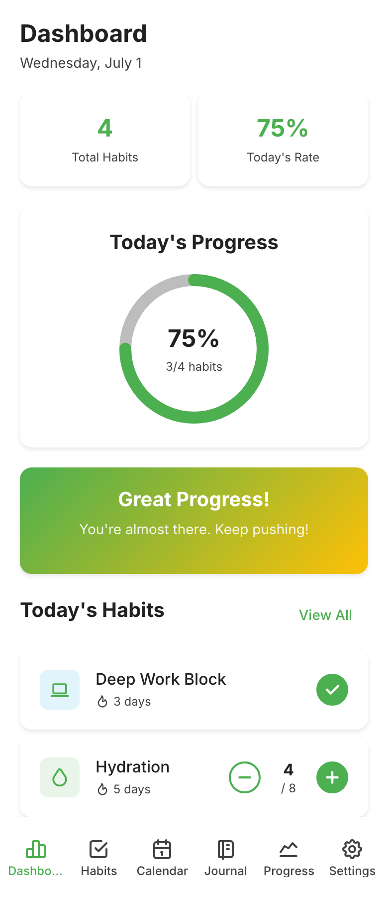
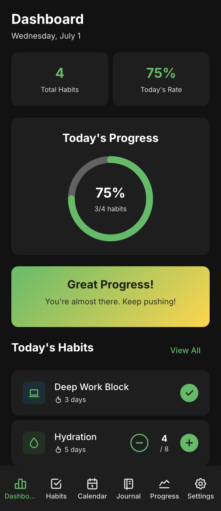
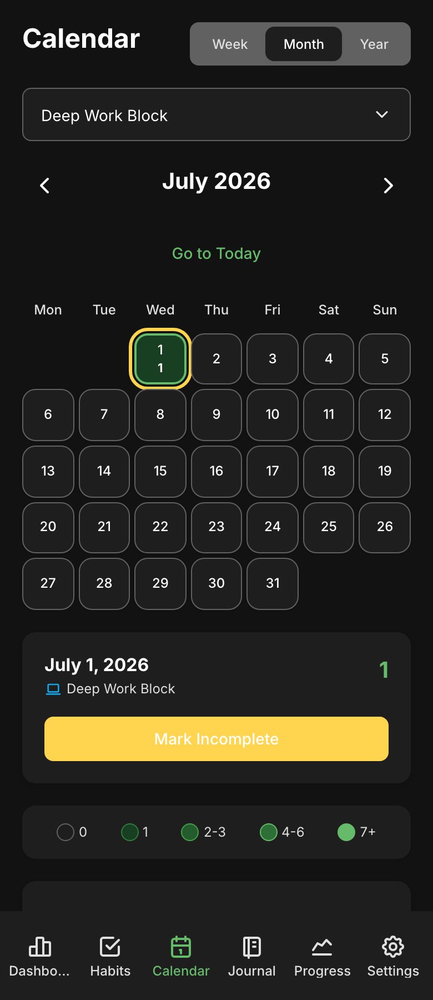

# Habit Tracker

An AI-assisted, full-stack habit tracker for building routines, visualizing streaks, and reflecting on progress. The app combines a polished React 19 interface with an Express API, SQLite persistence, database-backed settings, dark mode, and browser regression coverage.

**Repository description:** AI-assisted full-stack habit tracker with React, SQLite persistence, dark mode, journaling, and Playwright regression coverage.

**Suggested GitHub topics:** `ai-assisted-development`, `react`, `vite`, `express`, `sqlite`, `better-sqlite3`, `playwright`, `habit-tracker`, `productivity`, `journaling`, `dark-mode`, `responsive-design`, `accessibility`, `data-visualization`, `full-stack`

## Screenshots

The README screenshots use seeded example data generated by `npm run screenshots`.

| Dashboard - light mode | Dashboard - dark mode | Calendar - dark mode |
|---|---|---|
|  |  |  |

## Why This Repo

- **Product-quality UI** - mobile-first navigation, tablet split views, polished motion, dark mode, and readable empty states.
- **Real persistence** - habits, categories, journal entries, profile details, theme preference, and calendar preference live in SQLite through an Express REST API.
- **Domain-oriented code** - tracking rules are isolated in `src/domain/`, with project vocabulary documented in `CONTEXT.md`.
- **Regression coverage** - domain tests cover habit and journal rules; Playwright tests cover persisted flows, responsive surfaces, profile/avatar settings, and dark-mode contrast.
- **Reproducible public assets** - README screenshots are generated from a temp database, so docs assets do not depend on local personal data.

## Features

- **Dashboard** - daily overview, completion rate, circular progress, motivational messaging, quick binary check-off, and count-habit steppers.
- **Habit management** - create, edit, and delete habits with category, color, frequency, reminders, yes/no tracking, or count tracking with an optional daily goal.
- **Searchable icon catalog** - Tabler-based habit and category icons grouped by theme, with legacy emoji/string icon fallback for older data.
- **Categories** - seeded default categories for health, productivity, mindfulness, learning, social, creativity, and other habits.
- **Calendar view** - per-habit week, month, and year views with heatmap intensity, day details, period navigation, week-start preferences, and dark-mode contrast checks.
- **Progress & stats** - weekly bars, monthly trend charts, current and longest streaks, completion rates, and insight cards.
- **Journal** - dated reflections connected to habits, mood annotations, weekly timeline navigation, and search scoped to the selected week.
- **Settings & profile** - editable name/email, image avatar upload/removal, theme preference, reminder time, notification permission handling, and Sunday/Monday week-start selection.
- **Data management** - JSON export, CSV export, full backup, restore, and clear-all controls backed by the database.
- **Information pages** - privacy, terms, and support pages reachable from Settings.
- **Responsive layout** - mobile bottom navigation and wide-screen tablet split views for habit list/detail workflows.
- **Accessibility** - labeled controls, keyboard focus states, readable dark-mode controls, and Playwright assertions for overflow and contrast-sensitive surfaces.

## Tech Stack

| Area | Library |
|---|---|
| UI library | React 19 |
| Build tool | Vite 8 |
| Routing | React Router 7 |
| Styling | styled-components 6 |
| Animations | Framer Motion 12 |
| Charts | Recharts 3 |
| Icons | Tabler Icons React 3 |
| Dates | date-fns 4 |
| Celebrations | react-confetti 6 |
| API server | Express 5 |
| Database | SQLite through better-sqlite3 |
| Browser tests | Playwright |

## Getting Started

### Prerequisites

- Node.js 20.19+ (Node 22 recommended for Vite 8)
- npm

### Install

```bash
npm install
```

### Run Locally

```bash
npm run dev
```

The app opens at `http://localhost:3300`. The API listens at `http://127.0.0.1:3301`, and Vite proxies `/api` to that backend.

## Commands

| Command | Description |
|---|---|
| `npm run dev` | Start the Express API and Vite client together. Client: `http://localhost:3300`; API: `http://127.0.0.1:3301`. |
| `npm run dev:client` | Start only the Vite client on port `3300`; use it with a separately running API server. |
| `npm run server` | Start only the Express API server on `127.0.0.1:3301`. |
| `npm run dev:e2e` | Start the API and client against `.tmp/e2e/habit-tracker.db` for browser tests. Client: `http://127.0.0.1:3340`; API: `http://127.0.0.1:3341`. |
| `npm run test` | Run domain tests and Playwright browser tests. |
| `npm run test:domain` | Run domain and context tests through Vite SSR. |
| `npm run test:e2e` | Run the Playwright suite with an isolated temp database and runtime reset guard. |
| `npm run screenshots` | Seed example data in `.tmp/screenshots`, start isolated local servers on `3330/3331`, and capture README screenshots into `docs/images/`. |
| `npm run build` | Build the production bundle to `dist/` with source maps. |
| `npm run preview` | Serve the production build locally for preview. |
| `npm run dev:all` | Alias for `npm run dev`. |

### Runtime Options

| Option | Purpose |
|---|---|
| `HOST` | API bind host. Defaults to `127.0.0.1`. |
| `PORT` | API port. Defaults to `3301`; also drives Vite's default `/api` proxy target. |
| `VITE_API_TARGET` | Explicit Vite proxy target. The e2e and screenshot harnesses set this automatically. |
| `VITE_OPEN=true` | Open the Vite dev server in the browser on startup. |
| `HABIT_TRACKER_DB_PATH` | SQLite database path. Defaults to `server/data/habit-tracker.db`. |
| `HABIT_TRACKER_E2E=true` | Marks a runtime as safe for destructive test resets when the DB path is under `.tmp/e2e/`. |
| `E2E_CLIENT_PORT` / `E2E_API_PORT` | Override the ports used by `npm run dev:e2e` and Playwright. Defaults: `3340` / `3341`. |
| `SCREENSHOT_CLIENT_PORT` / `SCREENSHOT_API_PORT` | Override the ports used by `npm run screenshots`. Defaults: `3330` / `3331`. |

## Project Structure

```text
habit-tracker/
├── CONTEXT.md                 # Domain vocabulary for habits, completions, streaks, and journals
├── design-specifications.md   # Current UI component and screen specifications
├── docs/
│   ├── images/                # README screenshots generated from seeded example data
│   ├── implementation-summary.md
│   └── prompt.md
├── scripts/
│   ├── capture-readme-screenshots.mjs
│   ├── run-domain-tests.mjs
│   └── run-e2e-dev.mjs
├── server/
│   ├── db.js                  # SQLite schema, seed data, JSON row helpers, settings helpers
│   ├── index.js               # Express REST API
│   └── data/                  # Local SQLite database files, ignored by git
├── src/
│   ├── api/                   # Frontend API client
│   ├── components/            # Reusable UI components
│   ├── context/               # Habits, theme, preferences, toast, and navigation contexts
│   ├── domain/                # Habit tracking, journal timeline, and icon catalog rules
│   ├── screens/               # Route-level screens
│   └── styles/                # Theme and global styles
└── tests/
    ├── context/
    ├── domain/
    └── e2e/
```

## Architecture

The frontend uses React Context for app state and keeps domain rules in pure modules:

- `HabitsContext` loads and persists habits, categories, completions, and journal entries through `src/api/habitsApi.js`.
- `ThemeContext` stores light/dark preference in the database and removes legacy browser-storage values.
- `PreferencesContext` stores week-start preference in the database and feeds calendar, journal, and progress calculations.
- `ToastContext` owns notifications inside the UI.
- `NavigationContext` keeps the bottom navigation aligned with the active route.
- `src/domain/habitTracking.js` and `src/domain/journalTimeline.js` contain date, streak, range, and timeline rules covered by domain tests.

The backend stores each collection item as JSON in SQLite tables. This keeps the schema compact while still providing a durable, queryable `.db` file for local use.

## API

| Method & Path | Description |
|---|---|
| `GET /api/state` | Full app state: habits, categories, journal entries, and settings. |
| `GET /api/runtime` | Runtime marker used by the e2e reset guard. |
| `GET /api/settings/:key` / `PUT /api/settings/:key` | Read or persist database-backed settings such as `theme`, `profile`, and `preferences`. |
| `POST /api/habits` / `PUT /api/habits/:id` / `DELETE /api/habits/:id` | Create, update, or delete a habit. Deleting a habit also removes its journal entries. |
| `POST /api/categories` / `PUT /api/categories/:id` / `DELETE /api/categories/:id` | Manage categories. |
| `POST /api/journal` / `PUT /api/journal/:id` / `DELETE /api/journal/:id` | Manage journal entries. |
| `POST /api/restore` | Replace all stored app data from a backup payload. |
| `DELETE /api/data` | Clear all data and re-seed default categories. |

## Routes

| Path | Screen |
|---|---|
| `/` | Dashboard |
| `/habits` | Habits list or tablet split view |
| `/calendar` | Calendar heatmap |
| `/habit/:id` | Habit detail or tablet split view |
| `/progress` | Progress & stats |
| `/journal` | Journal |
| `/settings` | Settings |
| `/privacy` | Privacy policy |
| `/terms` | Terms of service |
| `/support` | Support |
| `/add-habit` | Add habit |
| `/edit-habit/:id` | Edit habit |

## Testing

Domain tests run with `npm run test:domain` and cover habit counts, binary toggles, date-targeted changes, streak calculation, journal timeline filtering, theme preference resolution, and week-start normalization.

Browser tests run with `npm run test:e2e`. Playwright starts `npm run dev:e2e`, verifies the API is using `.tmp/e2e/habit-tracker.db`, and only then allows reset/restore operations. The suite covers persisted habit flows, icon selection and legacy fallback, mobile edit stability, journal timelines, profile/avatar persistence, settings links, dark-mode controls, calendar contrast, and responsive smoke coverage.

## Documentation

- `CONTEXT.md` - domain vocabulary for the app.
- `design-specifications.md` - current component, screen, theme, motion, responsive, and accessibility specifications.
- `docs/implementation-summary.md` - implementation overview with file-level pointers.
- `docs/prompt.md` - original product/design brief.
- `docs/agents/` - agent workflow notes for GitHub Issues, triage labels, and domain docs.
