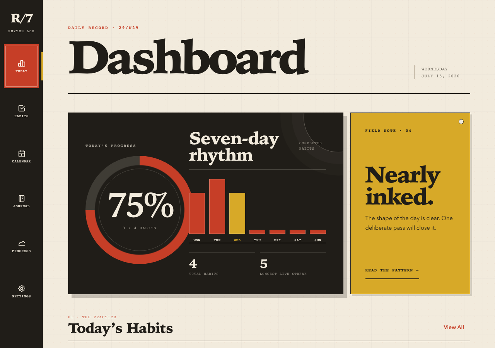
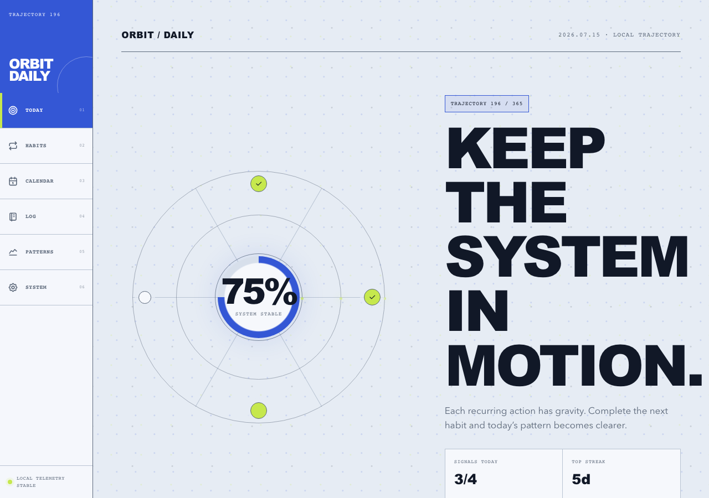
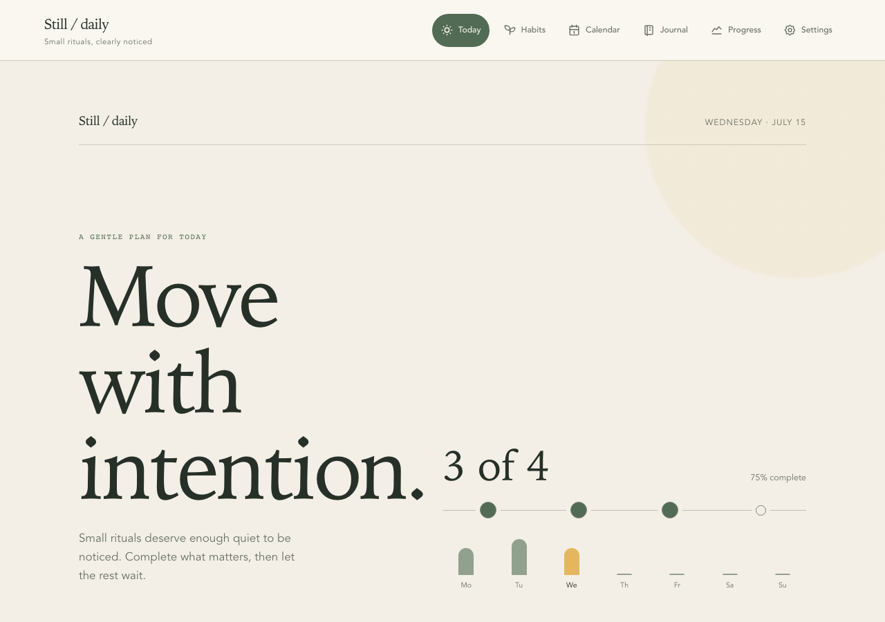
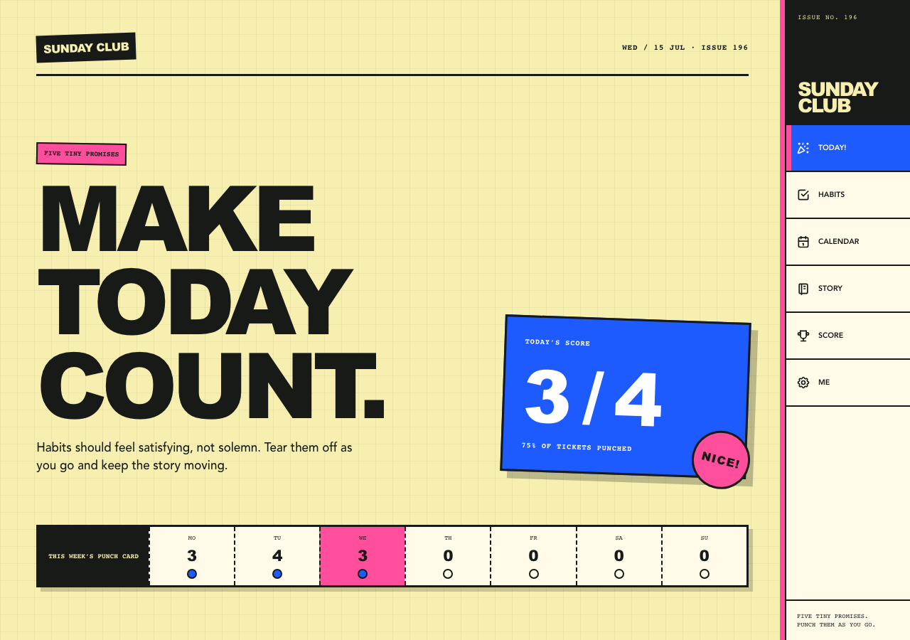
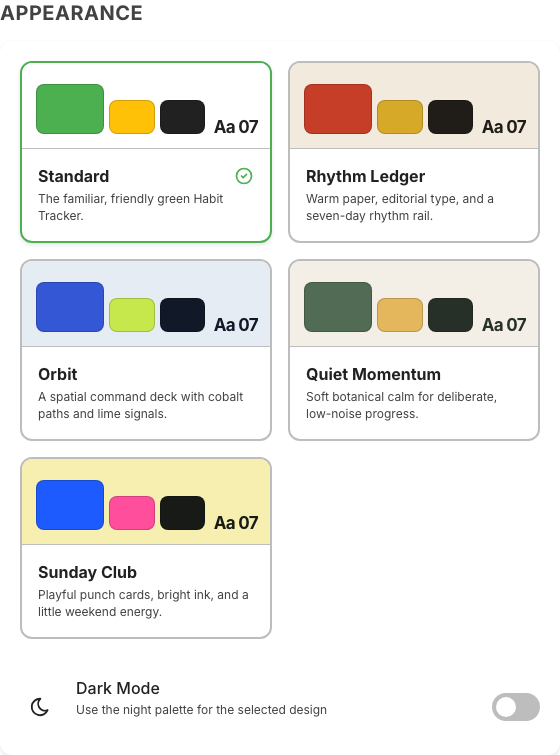

# Habit Tracker

An AI-assisted, full-stack habit tracker for building routines, visualizing streaks, and reflecting on progress. The app combines a polished React 19 interface with five switchable visual systems, an Express API, SQLite persistence, database-backed settings, dark mode, and browser regression coverage.

**Repository description:** AI-assisted full-stack habit tracker with five design modes, React, SQLite persistence, journaling, and Playwright coverage.

**Suggested GitHub topics:** `ai-assisted-development`, `react`, `vite`, `express`, `sqlite`, `better-sqlite3`, `playwright`, `habit-tracker`, `productivity`, `journaling`, `design-system`, `dark-mode`, `responsive-design`, `accessibility`, `data-visualization`, `full-stack`

## Screenshots

The README screenshots use seeded synthetic data generated by `npm run screenshots`.

| Standard | Rhythm Ledger | Orbit |
|---|---|---|
|  |  |  |

| Quiet Momentum | Sunday Club | Appearance settings |
|---|---|---|
|  |  |  |

| Standard dark mode | Calendar dark mode |
|---|---|
|  |  |

## Design Modes

The Appearance settings apply each visual system as a complete responsive shell: theme tokens, global texture, Dashboard composition, primary navigation, and desktop frame change together. Light and dark mode remain available within every design, and both preferences persist in SQLite.

| Design | Character | Wide-screen navigation |
|---|---|---|
| Standard | Friendly green cards and direct progress feedback | Top bar |
| Rhythm Ledger | Warm field journal with editorial typography and a seven-day rhythm rail | Left record rail |
| Orbit | Cobalt trajectory controls and orbital Completion signals | Left command rail |
| Quiet Momentum | Botanical restraint and deliberately low-noise progress | Top bar |
| Sunday Club | Bright punch cards and playful weekend energy | Right club rail |

Below the wide breakpoint, every design uses a touch-safe bottom navigation suited to its own visual language.

## Why This Repo

- **Product-quality UI** - five complete design modes, mobile-first navigation, tablet split views, polished motion, dark mode, and readable empty states.
- **Real persistence** - habits, categories, journal entries, profile details, design/theme preferences, calendar preference, and Daily Reminder settings live in SQLite through an Express REST API.
- **Domain-oriented code** - tracking rules are isolated in `src/domain/`, with project vocabulary documented in `CONTEXT.md`.
- **Regression coverage** - domain tests cover habit and journal rules; Playwright tests cover persisted flows, all design dashboards across responsive viewports, profile/avatar settings, and dark-mode contrast.
- **Reproducible public assets** - README screenshots are generated from a temp database, so docs assets do not depend on local personal data.

## Features

- **Dashboard** - design-specific daily overview, Completion rate and weekly rhythm, motivational messaging, quick yes/no check-off, and Count Habit steppers.
- **Habit management** - create, edit, and delete habits with category, color, frequency, reminders, yes/no tracking, or count tracking with an optional daily goal.
- **Searchable icon catalog** - Tabler-based habit and category icons grouped by theme, with legacy emoji/string icon fallback for older data.
- **Categories** - seeded default categories for health, productivity, mindfulness, learning, social, creativity, and other habits.
- **Calendar view** - per-habit week, month, and year views with heatmap intensity, day details, period navigation, week-start preferences, and dark-mode contrast checks.
- **Progress & stats** - weekly bars, monthly trend charts, current and longest streaks, completion rates, and insight cards.
- **Journal** - dated reflections connected to habits, mood annotations, weekly timeline navigation, and search scoped to the selected week.
- **Settings & profile** - editable name/email, image avatar upload/removal, Standard/Rhythm Ledger/Orbit/Quiet Momentum/Sunday Club design selection, dark mode, an app-wide Daily Reminder while the app is open, and Sunday/Monday week-start selection.
- **Data management** - JSON export, CSV export, canonical version 2 backup, safe restore of version 2 and legacy `1.0.0` files, and clear-all controls backed by the database.
- **Information pages** - privacy, terms, and support pages reachable from Settings.
- **Responsive layout** - mobile bottom navigation and wide-screen tablet split views for habit list/detail workflows.
- **Accessibility** - a skip-to-main link, labeled controls, keyboard focus states, readable dark-mode controls, and Playwright assertions for overflow and contrast-sensitive surfaces.

## Tech Stack

| Area | Library |
|---|---|
| UI library | React 19 |
| Build tool | Vite 8 |
| Routing | React Router 7 |
| Styling | styled-components 6 |
| Animations | Framer Motion 12 |
| Charts | Recharts 3 |
| Icons | Tabler Icons React 3 |
| Dates | date-fns 4 |
| Celebrations | react-confetti 6 |
| API server | Express 5 |
| Database | SQLite through better-sqlite3 |
| Browser tests | Playwright |

## Getting Started

### Prerequisites

- Node.js 24.x (run `nvm use` to select the version from `.nvmrc`)
- npm

### Install

```bash
npm install
```

### Run Locally

```bash
npm run dev
```

The app opens at `http://localhost:3300`. The API listens at `http://127.0.0.1:3301`, and Vite proxies `/api` to that backend.

## Commands

| Command | Description |
|---|---|
| `npm run dev` | Start the Express API and Vite client together. Client: `http://localhost:3300`; API: `http://127.0.0.1:3301`. |
| `npm run dev:client` | Start only the Vite client on port `3300`; use it with a separately running API server. |
| `npm run server` | Start only the Express API server on `127.0.0.1:3301`. |
| `npm run dev:e2e` | Start the API and client against `.tmp/e2e/habit-tracker.db` for browser tests. Client: `http://127.0.0.1:3340`; API: `http://127.0.0.1:3341`. |
| `npm run test` | Run domain, server, and Playwright browser tests. |
| `npm run test:domain` | Run domain and context tests through Vite SSR. |
| `npm run test:server` | Run transactional SQLite server tests. |
| `npm run test:e2e` | Run the Playwright suite with an isolated temp database and runtime reset guard. |
| `npm run screenshots` | Seed synthetic data in `.tmp/screenshots`, start isolated local servers on `3330/3331`, and capture the five dashboards, Appearance picker, and dark-mode README surfaces into `docs/images/`. |
| `npm run build` | Build the production bundle to `dist/` with source maps. |
| `npm run preview` | Serve the production build locally for preview. |
| `npm run dev:all` | Alias for `npm run dev`. |

### Runtime Options

| Option | Purpose |
|---|---|
| `HOST` | API bind host. Defaults to `127.0.0.1`. |
| `PORT` | API port. Defaults to `3301`; also drives Vite's default `/api` proxy target. |
| `VITE_API_TARGET` | Explicit Vite proxy target. The e2e and screenshot harnesses set this automatically. |
| `VITE_OPEN=true` | Open the Vite dev server in the browser on startup. |
| `HABIT_TRACKER_DB_PATH` | SQLite database path. Defaults to `server/data/habit-tracker.db`. |
| `HABIT_TRACKER_E2E=true` | Marks a runtime as safe for destructive test resets when the DB path is under `.tmp/e2e/`. |
| `E2E_CLIENT_PORT` / `E2E_API_PORT` | Override the ports used by `npm run dev:e2e` and Playwright. Defaults: `3340` / `3341`. |
| `SCREENSHOT_CLIENT_PORT` / `SCREENSHOT_API_PORT` | Override the ports used by `npm run screenshots`. Defaults: `3330` / `3331`. |

## Project Structure

```text
habit-tracker/
├── CONTEXT.md                 # Domain vocabulary for habits, completions, streaks, and journals
├── design-specifications.md   # Current UI component and screen specifications
├── docs/
│   ├── images/                # README screenshots generated from seeded example data
│   ├── implementation-summary.md
│   └── prompt.md
├── scripts/
│   ├── capture-readme-screenshots.mjs
│   ├── run-domain-tests.mjs
│   └── run-e2e-dev.mjs
├── shared/
│   └── defaultCategories.json # Seed and legacy-restore defaults shared by server and client
├── server/
│   ├── db.js                  # SQLite schema, row helpers, settings, and complete-state restore
│   ├── index.js               # Express REST API
│   └── data/                  # Local SQLite database files, ignored by git
├── src/
│   ├── adapters/              # Browser file, clock, and notification interfaces
│   ├── appDesign/             # Complete App Design registrations and fallback resolution
│   ├── api/                   # Frontend API client
│   ├── components/            # Reusable UI components
│   ├── context/               # Habits, Daily Reminder, theme, preferences, toast, and navigation contexts
│   ├── domain/                # Tracking rules plus injected persistence/effect coordinators
│   ├── screens/               # Route-level screens
│   └── styles/                # Design registry plus per-design light/dark themes and global styles
└── tests/
    ├── context/
    ├── domain/
    ├── e2e/
    └── server/
```

## Architecture

The frontend uses React Context for live app state. Pure calculations stay separate from persistence-aware coordinators, whose effects are supplied through injected interfaces:

- `HabitsContext` loads application state and adapts it to the Habit lifecycle and Journal Entry coordinators. Both return committed outcomes and serialize same-record writes; the Habit lifecycle owns creation metadata and orders create, edit, Completion, and deletion operations per Habit so stale writes cannot recreate deleted data.
- `src/domain/habitTracking.js` and `src/domain/journalTimeline.js` contain pure date, Completion, Streak, Calendar Period, and timeline calculations.
- `src/domain/dashboardHabitTracking.js` composes those shared calculations with the Habit lifecycle, waits for in-flight Habit writes to settle, and returns committed semantic outcomes for all five dashboard presentations. App Designs own wording, layout, motion, and feedback rendering.
- `src/domain/journalEntryWrites.js` coordinates injected persistence, same-entry ordering, exact rollback, and committed caller results.
- `src/domain/dailyReminder.js` owns Daily Reminder validation, persistence ordering, permission policy, scheduling, and incomplete-Habit notification decisions through injected interfaces. `DailyReminderContext` keeps one instance mounted above the router, and `src/adapters/browserDailyReminder.js` supplies browser clock and notification effects.
- `src/appDesign/catalog.jsx` is the single registration seam for each design's metadata, previews, light/dark themes, global styles, dashboard, primary navigation, and responsive frame.
- `ThemeContext` resolves the selected catalog registration, stores design and light/dark preferences in the database, and removes legacy browser-storage theme values.
- `PreferencesContext` stores week-start preference in the database and feeds calendar, journal, and progress calculations.
- `ToastContext` owns notifications inside the UI.
- `NavigationContext` keeps the bottom navigation aligned with the active route.
- `src/domain/backup.js` coordinates persisted-state reads and restore writes around pure canonical validation and legacy migration, while `src/adapters/browserBackup.js` owns browser file I/O.

The backend stores each collection item as JSON in SQLite tables. `server/db.js` owns complete restore as one transaction over Habits, Categories, Journal Entries, and settings and returns the authoritative `{ ok, state }` result.

## API

| Method & Path | Description |
|---|---|
| `GET /api/state` | Full app state: habits, categories, journal entries, and settings. |
| `GET /api/runtime` | Runtime marker used by the e2e reset guard. |
| `GET /api/settings/:key` / `PUT /api/settings/:key` | Read or persist database-backed settings such as `design`, `theme`, `profile`, `preferences`, and `dailyReminder`. |
| `POST /api/habits` / `PUT /api/habits/:id` / `DELETE /api/habits/:id` | Create, update, or delete a habit. Deleting a habit also removes its journal entries. |
| `POST /api/categories` / `PUT /api/categories/:id` / `DELETE /api/categories/:id` | Manage categories. |
| `POST /api/journal` / `PUT /api/journal/:id` / `DELETE /api/journal/:id` | Manage journal entries. |
| `POST /api/restore` | Atomically replace all stored app data and return `{ ok, state }` with authoritative committed state. |
| `DELETE /api/data` | Clear all data and re-seed default categories. |

## Routes

| Path | Screen |
|---|---|
| `/` | Dashboard |
| `/habits` | Habits list or tablet split view |
| `/calendar` | Calendar heatmap |
| `/habit/:id` | Habit detail or tablet split view |
| `/progress` | Progress & stats |
| `/journal` | Journal |
| `/settings` | Settings |
| `/privacy` | Privacy policy |
| `/terms` | Terms of service |
| `/support` | Support |
| `/add-habit` | Add habit |
| `/edit-habit/:id` | Edit habit |

## Testing

Domain tests run with `npm run test:domain` and cover Habit tracking, dashboard semantic outcomes, persistence-aware Completion and Journal Entry writes, App Design registrations, canonical backup validation/migration, journal timelines, and database-backed preference normalization. Server tests force complete-restore failures to verify SQLite rollback.

Browser tests run with `npm run test:e2e`. Playwright starts `npm run dev:e2e`, verifies the API is using `.tmp/e2e/habit-tracker.db`, and only then allows reset/restore operations. The suite covers cross-design Completion success, reload, rollback, and confetti suppression; every App Design's light/dark persistence matrix; committed Journal Entry feedback; canonical and legacy backup/restore including visible failure preservation; persisted habit flows; profile/avatar persistence; calendar contrast; and responsive smoke coverage.

## Documentation

- `CONTEXT.md` - domain vocabulary for the app.
- `design-specifications.md` - current component, screen, theme, motion, responsive, and accessibility specifications.
- `docs/implementation-summary.md` - implementation overview with file-level pointers.
- `docs/prompt.md` - original product/design brief.
- `docs/agents/` - agent workflow notes for GitHub Issues, triage labels, and domain docs.

## License

Habit Tracker is released under the [MIT License](LICENSE).
